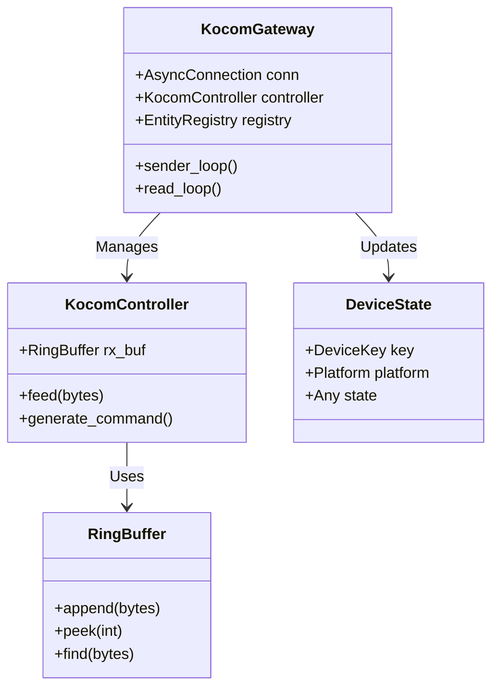
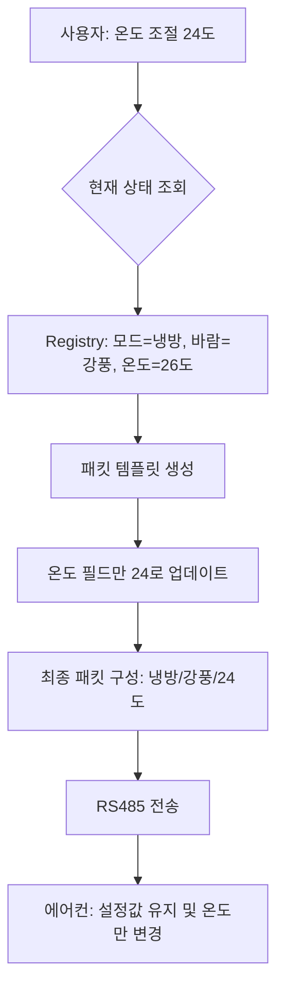

# Kocom Wallpad Integration (RS485)

[](https://github.com/hacs/integration)
[](https://github.com/wknight1/hacs-kocom-wallpad/releases)
[](https://github.com/wknight1)

코콤(Kocom) 월패드의 RS485 프로토콜을 분석하여 Home Assistant에 통합하는 커스텀 컴포넌트입니다.
EW11과 같은 RS485-WiFi/Ethernet 게이트웨이를 통해 통신하며, 높은 신뢰성과 빠른 반응 속도를 목표로 설계되었습니다.

## 🌟 Key Features

*   **Zero-Copy RingBuffer:** 고성능 원형 버퍼(Ring Buffer)를 도입하여 패킷 파싱 시 메모리 재할당을 최소화하고 CPU 점유율을 낮췄습니다.
*   **Smart Polling & Sync:** 제어 명령 송신 직후 상태 조회를 수행하는 '즉시 동기화(Immediate Sync)' 알고리즘으로 명령 유실을 방지합니다.
*   **Resilient Self-Healing:** 공유기 재부팅 등 네트워크 장애 발생 시 지수 백오프로 재연결을 시도하며, 복구 직후 모든 기기 상태를 자동으로 재탐색합니다.
*   **Active Keep-Alive:** 25초 유휴 시마다 세션 유지 패킷을 전송하여 TCP 연결이 끊기는 것을 방지하고 명령 반응 속도를 최적화했습니다.
*   **Health Monitoring:** 월패드 응답을 실시간 감시(30분 타임아웃)하여 전원 장애 시 엔티티를 자동으로 '사용 불가능(Unavailable)'으로 전환하여 상태 오보를 방지합니다.
*   **Atomic Self-Healing:** `asyncio.Lock`을 기반으로 한 원자적 재연결 로직으로 중복 연결 시도를 방지하고 안정적으로 통신을 복구합니다.

---

## 🏗 System Architecture

### 1. Data Flow Sequence

Home Assistant 사용자가 명령을 내렸을 때, 내부적으로 어떻게 처리되는지 보여주는 시퀀스 다이어그램입니다.

```mermaid
sequenceDiagram
    participant User as 👤 User (HA)
    participant GW as ⚙️ Gateway (Integration)
    participant Wallpad as 📟 Wallpad (RS485)

    User->>GW: 1. Turn ON (Light)
    GW->>Wallpad: 2. Send HEX Command (0xAA 0x55...)
    Note over GW, Wallpad: Timeout: 1.0s (Retrying up to 3 times)
    Wallpad-->>GW: 3. ACK (Physical Signal)
    
    rect rgb(20, 50, 20)
        Note right of GW: ✅ Secure State Sync
        GW->>Wallpad: 4. Immediate Query (0x00)
        Wallpad-->>GW: 5. State Report (Status Packet)
    end
    
    GW->>User: 6. Update Entity State
```



### 2. Component Architecture



### 3. 에어컨 제어 최적화: 상태 보존형 패킷 재구성 (State-Preserving)

v2.2.1 버전부터 적용된 에어컨 제어 로직은 단순히 명령만 보내는 것이 아니라, 현재의 디바이스 상태를 원자적으로 유지하면서 필요한 속성만 변경하는 **'상태 보존형(State-Preserving)'** 방식을 사용합니다.

#### **기술적 배경**
에어컨 제어 패킷(RS485)은 전원, 모드, 설정 온도, 바람 세기 등이 하나의 페이로드에 묶여 전송됩니다. 특정 속성(예: 온도)만 패킷에 담아 보낼 경우, 월패드가 나머지 정보(예: 바람 세기)를 `0` 혹은 `기본값`으로 해석하여 기존 설정이 풀리거나 에어컨에서 오류 비프음이 발생할 수 있습니다.

#### **개선된 제어 흐름**



#### **주요 이점**
*   **설정 유지:** 온도를 바꿨는데 바람 세기가 갑자기 약풍으로 변하는 등의 부작용이 없습니다.
*   **비프음 방지:** 불완전한 패킷(모든 값이 0인 패킷 등) 전송을 방지하여 월패드 및 에어컨의 오동작 알림(Beep)을 차단합니다.
*   **섀도우 레지스트리(Shadow Registry) 활용:** 실제 물리 패킷이 오기 전이라도 메모리상의 마지막 상태를 참조하여 가장 정확한 명령을 생성합니다.

---

## 🚀 Advanced Setup Guide

### 1. EW11 Gateway Configuration
안정적인 통신을 위해 EW11 설정을 다음과 같이 권장합니다.

| Setting | Value | Description |
| :--- | :--- | :--- |
| **Baudrate** | `9600` | 코콤 월패드 표준 속도 |
| **Data Size** | `8` | 8 data bits |
| **Parity** | `None` | No parity |
| **Stop Bits** | `1` | 1 stop bit |
| **Flow Control** | `None` | 흐름 제어 없음 |
| **Buffer Size** | `512` | 패킷 처리 최적화 값 |
| **Gap Time** | `50ms` | 패킷 종료 감지 지연 시간 |
| **Keep Alive** | `10s` | TCP 연결 유지 간격 |
| **Timeout** | `30s` | 소켓 자동 종료 타임아웃 |

### 2. HACS Installation
1.  Home Assistant의 **HACS > Integrations** 메뉴로 이동합니다.
2.  우측 상단 메뉴(⋮)에서 **Custom repositories**를 선택합니다.
3.  Repository URL에 `https://github.com/wknight1/kocom-wallpad`를 입력하고, 카테고리를 **Integration**으로 선택합니다.
4.  **Kocom Wallpad**를 검색하여 설치하고 HA를 재시작합니다.

### 3. Integration Configuration
1.  **설정 > 기기 및 서비스 > 통합 구성요소 추가** 버튼을 클릭합니다.
2.  **Kocom Wallpad**를 검색하여 선택합니다.
3.  EW11의 **IP 주소**와 **포트(예: 8899)**를 입력합니다.

---

## 📂 Project Structure

```text
custom_components/kocom_wallpad/
├── gateway.py      # 통신 루프, 재시도 로직, 엔티티 레지스트리 관리
├── controller.py   # 패킷 파싱(RingBuffer), 명령 생성, 장치별 핸들러
├── transport.py    # Asyncio 기반 TCP/Serial 연결 관리
├── const.py        # 상수 정의 (재시도 횟수, 타임아웃 등)
├── models.py       # 데이터 모델 (DeviceKey, DeviceState)
└── ... (platforms) # light, climate, fan, sensor 등
```

---

## 🔧 Troubleshooting & FAQ

### Q1. 'int object is not callable' 에러가 발생합니다.
구형 `RingBuffer` 구현체에서 `__len__` 메서드에 `@property` 데코레이터를 잘못 사용하여 발생했던 문제입니다. 현재 버전(v2.0.5 이상)에서는 해당 로직이 수정되었으며, `len()` 함수 호출 시 정상적으로 버퍼 크기를 반환합니다.

### Q2. 명령을 보냈는데 반응이 느리거나 씹힙니다.
코콤 월패드 네트워크는 9600bps로 매우 느립니다. 또한 EW11의 무선 네트워크 상태에 따라 지연이 발생할 수 있습니다.
*   본 통합 구성요소는 **최대 3회 재시도**를 수행합니다.
*   명령 후 상태가 즉시 반영되지 않더라도, **강제 상태 동기화(Immediate Sync)** 패킷이 후속으로 전송되어 상태를 보정합니다.

### Q3. 일부 기기가 발견되지 않습니다.
월패드 모델마다 지원하는 패킷이 다를 수 있습니다. 아래의 **디버그 로깅 가이드**를 따라 로그를 추출하여 제보해 주세요.

---

## 🔍 Debugging Guide (로깅 가이드)

문제가 발생할 경우, 다음 방법 중 하나로 상세 로그를 확인할 수 있습니다.

### 방법 1: UI를 통한 간편 활성화 (권장)
1.  **설정 > 기기 및 서비스 > 통합 구성요소** 메뉴로 이동합니다.
2.  **Kocom Wallpad** 카드를 찾습니다.
3.  카드 우측 하단의 **점 세 개(⋮) 메뉴**를 누르고 **'디버그 로깅 활성화'**를 클릭합니다.
4.  문제를 재현(예: 조명 작동)한 후, 다시 같은 메뉴에서 **'디버그 로깅 비활성화'**를 누르면 로그 파일이 즉시 다운로드됩니다.

### 방법 2: 진단 데이터 추출 (JSON)
로그와 별도로 현재 시스템의 수치화된 상태를 보고 싶을 때 사용합니다.
1.  방법 1과 동일하게 **Kocom Wallpad** 카드로 이동합니다.
2.  **'진단 정보 다운로드'** 메뉴를 클릭하면 현재 연결 상태, 큐 부하, 발견된 엔티티 수 등이 포함된 JSON 파일이 다운로드됩니다.

### 방법 3: YAML 설정을 통한 영구 활성화
특정 모듈의 로그만 집중적으로 보고 싶을 때 유용합니다.
```yaml
logger:
  default: info
  logs:
    # 전체 로그 (가장 권장)
    custom_components.kocom_wallpad: debug
    # 특정 모듈만 보기 (선택 사항)
    # custom_components.kocom_wallpad.transport: debug  # 통신/세션 관련
    # custom_components.kocom_wallpad.controller: debug # 패킷 파싱 관련
    # custom_components.kocom_wallpad.gateway: debug    # 제어 로직 관련
```

### 로그 확인 방법
*   **실시간 확인:** `설정 > 시스템 > 로그` 메뉴에서 우측 하단 **'전체 로그 로드'** 버튼 클릭.
*   **파일 확인:** 홈어시스턴트 설정 폴더(`config/`) 내의 `home-assistant.log` 파일 확인.

---

## 📜 License

This project is licensed under the MIT License - see the [LICENSE](LICENSE) file for details.

Copyright (c) 2024 wknight1