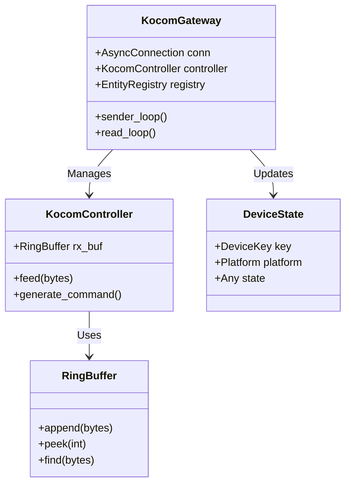

# Kocom Wallpad Integration (RS485)

[](https://github.com/hacs/integration)
[](https://github.com/wknight1/kocom-wallpad/releases)
[](https://github.com/wknight1)

코콤(Kocom) 월패드의 RS485 프로토콜을 분석하여 Home Assistant에 통합하는 커스텀 컴포넌트입니다.
EW11과 같은 RS485-WiFi/Ethernet 게이트웨이를 통해 통신하며, 높은 신뢰성과 빠른 반응 속도를 목표로 설계되었습니다.

## 🌟 Key Features

*   **Zero-Copy RingBuffer:** 고성능 원형 버퍼(Ring Buffer)를 도입하여 패킷 파싱 시 메모리 재할당을 최소화하고 CPU 점유율을 낮췄습니다.
*   **Smart Polling & Sync:** 제어 명령 송신 직후 상태 조회를 수행하는 '즉시 동기화(Immediate Sync)' 알고리즘으로 명령 유실을 방지합니다.
*   **Atomic Self-Healing:** `asyncio.Lock`을 기반으로 한 원자적 재연결 로직으로 중복 연결 시도를 방지하고 안정적으로 통신을 복구합니다.
*   **Backpressure Control:** 송신 큐 크기 제한 및 스로틀링을 통해 하드웨어 지연 상황에서도 Home Assistant 메인 서비스의 자원을 보호합니다.
*   **다양한 기기 지원:** 조명, 난방, 가스, 환기, 에어컨, 엘리베이터, 대기전력 차단 스위치 등.

---

## 🏗 System Architecture

### 1. Data Flow Sequence

Home Assistant 사용자가 명령을 내렸을 때, 내부적으로 어떻게 처리되는지 보여주는 시퀀스 다이어그램입니다.

```mermaid
sequenceDiagram
    participant User as 👤 User (HA)
    participant GW as ⚙️ Gateway (Integration)
    participant Wallpad as 📟 Wallpad (RS485)

    User->>GW: 1. Turn ON (Light)
    GW->>Wallpad: 2. Send HEX Command (0xAA 0x55...)
    Note over GW, Wallpad: Timeout: 1.0s (Retrying up to 3 times)
    Wallpad-->>GW: 3. ACK (Physical Signal)
    
    rect rgb(20, 50, 20)
        Note right of GW: ✅ Secure State Sync
        GW->>Wallpad: 4. Immediate Query (0x00)
        Wallpad-->>GW: 5. State Report (Status Packet)
    end
    
    GW->>User: 6. Update Entity State
```



### 2. Component Architecture



---

## 🚀 Advanced Setup Guide

### 1. EW11 Gateway Configuration
안정적인 통신을 위해 EW11 설정을 다음과 같이 권장합니다.

| Setting | Value | Description |
| :--- | :--- | :--- |
| **Baudrate** | `9600` | 코콤 월패드 표준 속도 |
| **Data Size** | `8` | 8 data bits |
| **Parity** | `None` | No parity |
| **Stop Bits** | `1` | 1 stop bit |
| **Flow Control** | `None` | 흐름 제어 없음 |
| **Protocol** | `TCP Server` | HA가 접속할 수 있도록 서버 모드 |
| **Buffer Size** | `1024` | 패킷 단편화 방지 |
| **Gap Time** | `50ms` | 패킷 간 최소 간격 |

### 2. HACS Installation
1.  Home Assistant의 **HACS > Integrations** 메뉴로 이동합니다.
2.  우측 상단 메뉴(⋮)에서 **Custom repositories**를 선택합니다.
3.  Repository URL에 `https://github.com/wknight1/kocom-wallpad`를 입력하고, 카테고리를 **Integration**으로 선택합니다.
4.  **Kocom Wallpad**를 검색하여 설치하고 HA를 재시작합니다.

### 3. Integration Configuration
1.  **설정 > 기기 및 서비스 > 통합 구성요소 추가** 버튼을 클릭합니다.
2.  **Kocom Wallpad**를 검색하여 선택합니다.
3.  EW11의 **IP 주소**와 **포트(예: 8899)**를 입력합니다.

---

## 📂 Project Structure

```text
custom_components/kocom_wallpad/
├── gateway.py      # 통신 루프, 재시도 로직, 엔티티 레지스트리 관리
├── controller.py   # 패킷 파싱(RingBuffer), 명령 생성, 장치별 핸들러
├── transport.py    # Asyncio 기반 TCP/Serial 연결 관리
├── const.py        # 상수 정의 (재시도 횟수, 타임아웃 등)
├── models.py       # 데이터 모델 (DeviceKey, DeviceState)
└── ... (platforms) # light, climate, fan, sensor 등
```

---

## 🔧 Troubleshooting & FAQ

### Q1. 'int object is not callable' 에러가 발생합니다.
구형 `RingBuffer` 구현체에서 `__len__` 메서드에 `@property` 데코레이터를 잘못 사용하여 발생했던 문제입니다. 현재 버전(v2.0.5 이상)에서는 해당 로직이 수정되었으며, `len()` 함수 호출 시 정상적으로 버퍼 크기를 반환합니다.

### Q2. 명령을 보냈는데 반응이 느리거나 씹힙니다.
코콤 월패드 네트워크는 9600bps로 매우 느립니다. 또한 EW11의 무선 네트워크 상태에 따라 지연이 발생할 수 있습니다.
*   본 통합 구성요소는 **최대 3회 재시도**를 수행합니다.
*   명령 후 상태가 즉시 반영되지 않더라도, **강제 상태 동기화(Immediate Sync)** 패킷이 후속으로 전송되어 상태를 보정합니다.

### Q3. 일부 기기가 발견되지 않습니다.
월패드 모델마다 지원하는 패킷이 다를 수 있습니다. 디버그 로그를 활성화하여 수신되는 패킷(`raw=...`)을 이슈 트래커에 제보해 주시면 분석해 드립니다.
```yaml
logger:
  default: info
  logs:
    custom_components.kocom_wallpad: debug
```

---

## 📜 License

This project is licensed under the MIT License - see the [LICENSE](LICENSE) file for details.

Copyright (c) 2024 wknight1