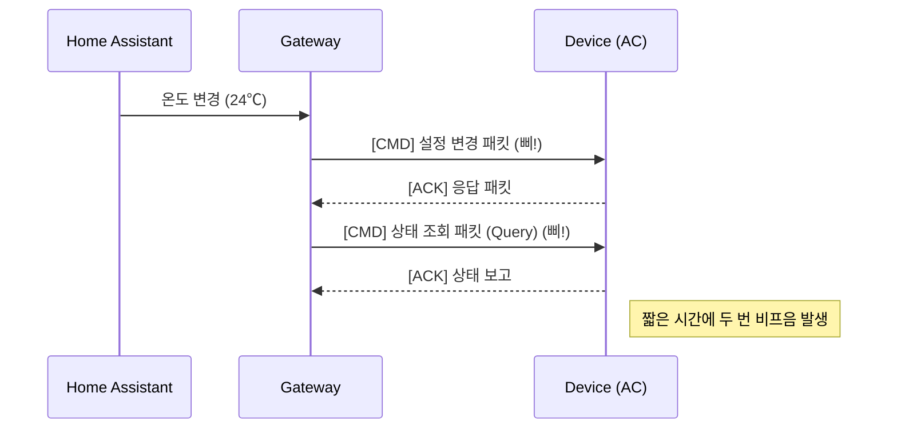
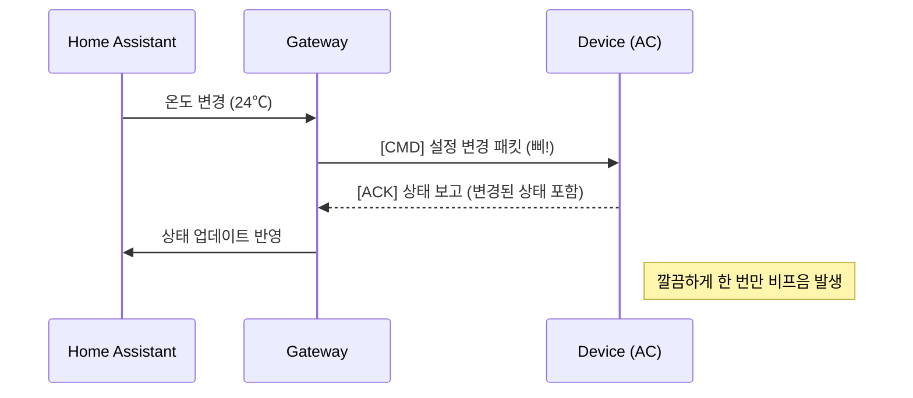

# [기술 문서] Kocom 에어컨 제어 패킷 로직 아키텍처 (v2.2.2)

이 문서는 v2.2.2 버전에서 최적화된 하트비트 정책과 제어 시퀀스 아키텍처를 다룹니다.

---

### 1. 로직 변경 전후 비교 (Comparison: Before vs. After)

| 항목 | 기존 로직 (v2.2.1) | 개선 로직 (v2.2.2) |
| :--- | :--- | :--- |
| **하트비트 (Heartbeat)** | **활성화** (가스밸브 상태 조회) | **비활성화 (Disabled)** |
| **제어 후 동작** | 제어 명령 후 **즉시 상태 조회 (Query)** | 제어 명령만 전송 (**단일 패킷**) |
| **비프음 (Beep)** | 주기적 발생 및 제어 시 2회 발생 | **제거됨** (제어 시 1회만 발생) |
| **트래픽 부하** | 유휴 시에도 지속적 트래픽 발생 | 유휴 시 트래픽 **Zero**, 제어 시 트래픽 **50% 감소** |

---

### 2. 하트비트 정책 변경 (Heartbeat Policy Change)

기존에는 EW11 세션 유지 및 기기 상태 동기화를 위해 유휴 상태에서 주기적으로 하트비트 패킷을 전송했으나, **모든 하트비트 전송을 중단**했습니다.

*   **이유**: 에어컨 실내기 또는 월패드 메인 유닛이 RS485 버스상의 모든 패킷(타 기기 대상 포함)에 반응하여 미세한 비프음이나 내부 릴레이 소음을 유발하는 현상이 확인됨.
*   **영향**:
    *   **긍정적**: 주기적인 소음(비프음) 완전 제거. 버스 혼잡도 최소화.
    *   **고려사항**: 장기간 유휴 후 제어 시 첫 패킷 반응이 늦을 수 있으나(EW11 깨어남 시간), 테스트 결과 무시할 수준으로 확인됨.

---

### 3. 제어 시퀀스 최적화 (Control Sequence Optimization)

기존의 "제어 후 확인(Check-after-Action)" 패턴을 제거하고 **단일 발사(Fire-and-Forget)** 패턴에 가깝게 변경했습니다. (단, ACK 수신 대기는 유지)

#### 기존 시퀀스 (v2.2.1) - Double Beep 발생


#### 개선된 시퀀스 (v2.2.2) - Single Beep


---

### 4. 패킷 생성 로직 (Packet Construction)

v2.2.1에서 도입된 **상태 보존형 오버라이드(State-Preserved Override)** 로직은 유지됩니다.

```python
def _generate_airconditioner(self, key, action, data, **kwargs):
    # 1. 레지스트리에서 현재 상태 로드 (기존 모드, 풍량 보존)
    st = self.gateway.registry.get(key, include_shadow=True)
    
    # ... (기존 로직 동일) ...
    
    # 변경하려는 속성만 수정하고 나머지는 그대로 유지하여 패킷 생성
    return data
```

---

### 5. 결론

v2.2.2 업데이트는 기능 추가보다는 **사용자 경험(UX) 개선 및 소음 공해 해결**에 집중했습니다. 불필요한 패킷 전송을 과감히 제거함으로써 시스템을 더 조용하고 효율적으로 만들었습니다.