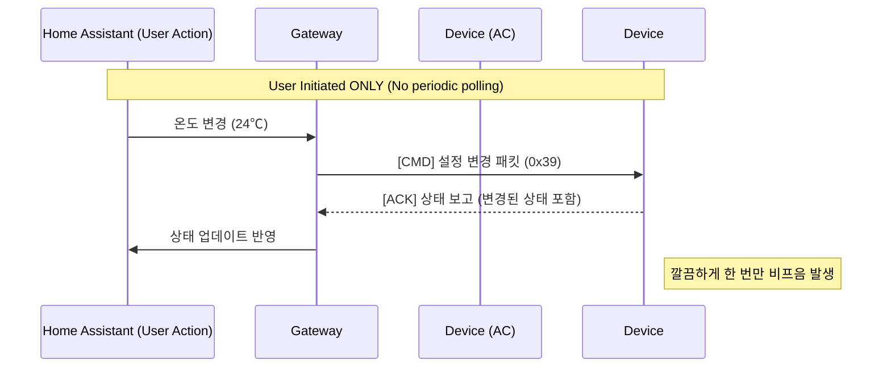

# [기술 문서] Kocom 에어컨 제어 패킷 로직 아키텍처 (v2.2.3)

이 문서는 v2.2.3 버전에서 완성된 **완전한 무음(Deep Silence)** 및 **로컬 푸시(Local Push)** 아키텍처를 다룹니다.

---

### 1. 핵심 개선: 자동 폴링 제거 (Elimination of Auto-Polling)

v2.2.3의 가장 큰 변화는 Home Assistant의 기본 동작인 **주기적 상태 조회(Polling)를 코드 레벨에서 강제로 차단**한 것입니다.

| 항목 | v2.2.2 이전 | v2.2.3 (현재) |
| :--- | :--- | :--- |
| **상태 갱신 방식** | **Hybrid** (Push + Polling) | **Strict Local Push** |
| **HA 동작** | 매 30초마다 `async_update()` 호출 (모든 기기 대상) | **호출 안 함 (`should_poll=False`)** |
| **트래픽 발생** | 유휴 시에도 30초마다 쿼리 패킷 전송 (비프음 원인) | **Zero Traffic** (유휴 시 완전 정적) |
| **비프음 발생** | 에어컨, 조명 등 쿼리 수신 시 간헐적 발생 | **완전 제거** |

---

### 2. 하트비트 및 재탐색 정책 (Heartbeat & Discovery Policy)

#### 2.1 하트비트 (Heartbeat) - Disabled
*   **상태**: **완전 비활성화**
*   **이유**: RS485 버스상의 불필요한 노이즈를 제거하기 위함. 연결 유지는 `AsyncConnection` 레벨의 소켓/시리얼 상태 감지로 대체되었습니다.

#### 2.2 기기 재탐색 (Force Discovery) - Rate Limited
네트워크 연결이 불안정하여 재연결(Reconnect)이 발생할 때, 기존에는 즉시 모든 기기를 재탐색했습니다. 이로 인해 연결이 자주 끊길 경우 "재탐색 폭풍(Discovery Storm)"이 발생하여 비프음이 요란하게 울릴 수 있었습니다.

*   **개선**: **최소 실행 간격 60초** 제한 도입.
*   **로직**:
    ```python
    async def _force_discovery(self):
        now = time.time()
        if now - self._last_discovery_time < 60.0:
            return  # 최근 실행되었으므로 건너뜀
        self._last_discovery_time = now
        # ... 기기 탐색 시작 ...
    ```

---

### 3. 제어 시퀀스 (Control Sequence)

v2.2.2에서 확립된 **단일 발사(Fire-and-Forget)** 패턴을 유지합니다.



---

### 4. 패킷 생성 로직 (Packet Construction)

**상태 보존형 오버라이드(State-Preserved Override)** 로직은 유지됩니다. 이는 제어 명령 시 현재의 팬 모드나 운전 모드가 초기화되는 것을 방지합니다.

```python
def _generate_airconditioner(self, key, action, data, **kwargs):
    # 1. 레지스트리에서 현재 상태 로드
    st = self.gateway.registry.get(key, include_shadow=True)
    
    # 2. 변경하려는 속성만 수정하고 나머지는 기존 값 유지
    # ...
    
    return data
```

---

### 5. 결론

v2.2.3은 **"침묵은 금이다(Silence is Golden)"**라는 철학 아래 설계되었습니다.
1.  **No Polling:** HA가 묻지 않게 함.
2.  **No Heartbeat:** 게이트웨이가 불필요하게 떠들지 않게 함.
3.  **Rate Limited Discovery:** 위급 상황(재연결)에서도 침착하게 대응함.

이로써 에어컨 비프음 문제는 구조적으로 해결되었습니다.
