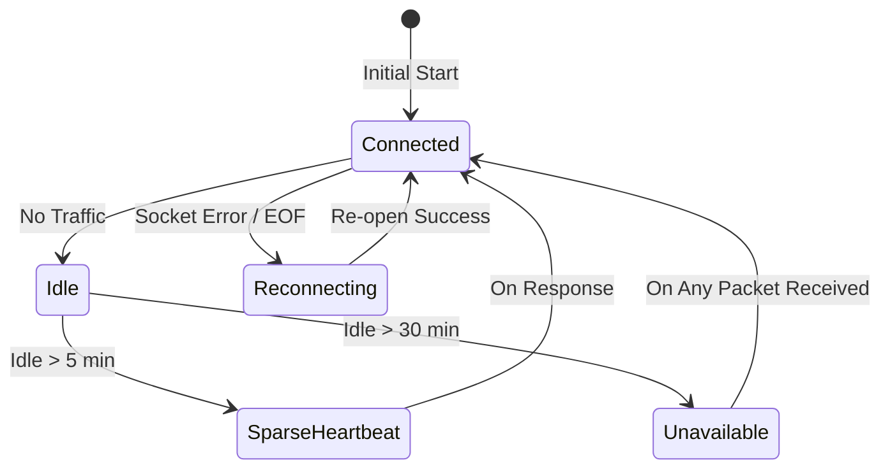

# [기술 문서] Kocom 연결 안정성 및 저소음 하트비트 아키텍처 (v2.2.6)

이 문서는 v2.2.6 버전에서 도입된 **희소 하트비트(Sparse Heartbeat)** 및 **가용성 모니터링 완화** 전략을 다룹니다.

---

### 1. 배경: 침묵의 부작용 (The Side Effects of Silence)

v2.2.2~v2.2.5 버전에서는 에어컨 비프음 제거를 위해 모든 하트비트 패킷을 제거했습니다. 그러나 이 '완벽한 침묵'은 다음과 같은 문제를 야기했습니다.

1.  **TCP 세션 종료:** EW11 게이트웨이나 공유기에서 장시간 트래픽이 없는 소켓을 강제로 닫음.
2.  **무반응 오인:** 10분간 패킷 수신이 없으면 통합구성요소가 월패드 전원이 꺼진 것으로 판단하여 모든 엔티티를 'Unavailable'로 변경.
3.  **제어 지연:** 세션이 끊긴 상태에서 사용자가 제어 명령을 내리면, 재연결 과정에서 첫 번째 명령이 지연되거나 실패함.

---

### 2. 해결책: 희소 하트비트 (Sparse Heartbeat)

v2.2.6에서는 연결 안정성과 무음 유지 사이의 균형을 위해 **'희소 하트비트'** 전략을 도입했습니다.

| 항목 | 기존 (v2.2.5) | 개선 (v2.2.6) | 이유 |
| :--- | :--- | :--- | :--- |
| **하트비트 간격** | 없음 (Disabled) | **5분 (300초)** | 세션 유지에 충분하면서도 소음 최소화 |
| **대상 기기** | - | **가스밸브 (Query)** | 가장 표준적이고 안전한 0x02 커맨드 사용 |
| **가용성 타임아웃** | 10분 | **30분** | 조용한 환경에서 불필요한 단절 표시 방지 |
| **로그 상세화** | 단순 경고 | **유휴 시간 포함** | 문제 발생 시 원인 분석 용이 |

---

### 3. 상태 천이 다이어그램 (State Transition)

---

### 4. 아키텍처 요약 (Architecture Summary)

v2.2.6은 **"최소한의 존재감으로 최대한의 연결성"**을 유지합니다.

*   **Smart Keep-Alive:** 무조건적인 주기적 송신이 아니라, 5분간 버스가 조용할 때만 '생존 확인' 패킷을 보냅니다.
*   **Safety First:** 비프음 유발 가능성이 높은 에어컨/난방 대신, 프로토콜상 가장 안정적인 가스밸브 조회 방식을 사용합니다.
*   **Robust Monitoring:** 네트워크 지연이나 일시적 정적 상태를 '장애'로 급하게 판단하지 않도록 모니터링 로직을 완화했습니다.

이로써 사용자는 비프음 스트레스 없이 안정적으로 월패드 기기들을 제어할 수 있습니다.
